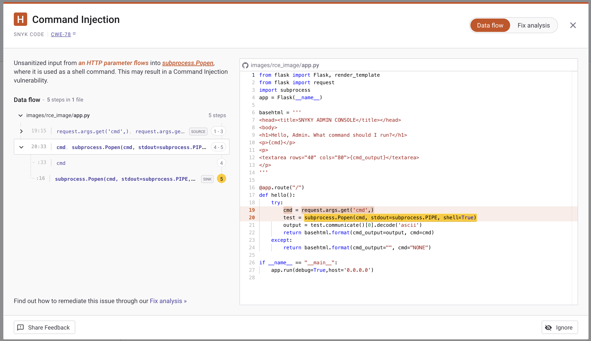
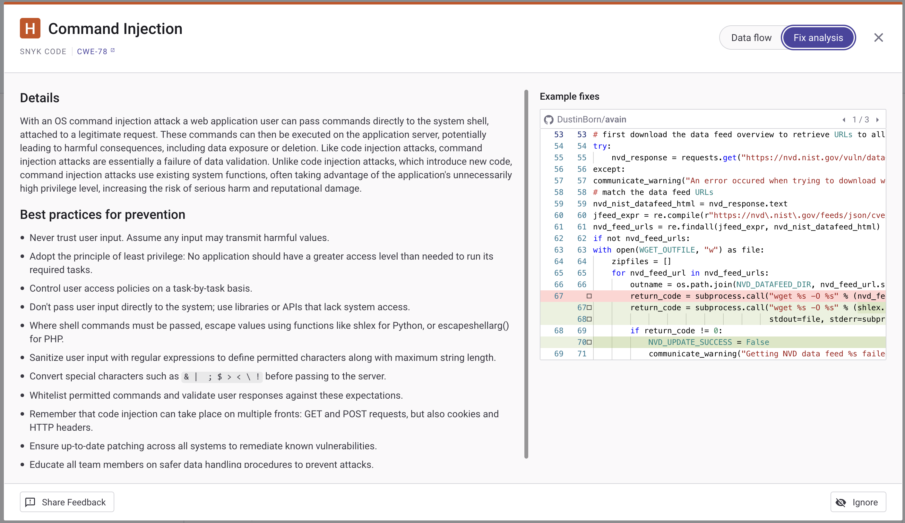
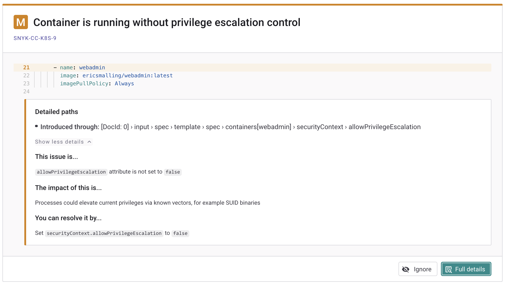

# Hands-on Hacking K8s Workshop | Section 3: Mitigation Discussion

<!-- TOC -->
* [Hands-on Hacking K8s Workshop | Section 3: Mitigation Discussion](#hands-on-hacking-k8s-workshop--section-3--mitigation-discussion)
  * [Potential mitigations](#potential-mitigations)
    * [Application and container vulnerability scanning](#application-and-container-vulnerability-scanning)
    * [ServiceAccount token auto-mount](#serviceaccount-token-auto-mount)
    * [Disallow privilege escalation in PSP](#disallow-privilege-escalation-in-psp)
    * [Lock down your ServiceAccount RBAC permissions](#lock-down-your-serviceaccount-rbac-permissions)
    * [Be explicit with your namespaces](#be-explicit-with-your-namespaces)
    * [Network Policies](#network-policies)
  * [Next Step](#next-step)
<!-- TOC -->

## Potential mitigations
The main takeaways for the vulnerabilities you just exploited is that you need to be proactive in protecting your
applications and clusters on Kubernetes and make it harder for accidental exposures to hand over the keys—literally—to bad actors.
Simply using defaults is not going to work, you need to explicitly chose more secure options for your application deployments
and cluster configurations and reduce the damage that can happen if/when a security incident does occur. 

Let's take a look at a few simple things we could have done to head off much—if not all—of the attacks.

### Application and container vulnerability scanning
Obviously, the vulnerability in that application is the most glaring issue here. Scanning your application and his libraries
is the first thing you'd probably want to tackle, so you're not deploying applications with these kinds of vulnerabilities
in them.

Next, scanning your container images is critical for similar reasons. Vulnerabilities brought in from a bas image or
OS-level packages that you might be building into your images can introduce the similar exploit possibilities.

For example, running our webadmin app's Dockerfile through Snyk's image scanner (via GitHub integration) it shows that the
`python:3` base image is currently bringing 285 vulnerabilities to the party including 4 Critical and 37 High ones.
It recommends switching to one of a few other options that drop our knownn vulnerability counts to as low as 48.


Our application is extremely simplistic so I don't have any scan examples to show from it's library dependencies, but here's
an example of the SAST scan correctly finding the line of code that implements the contrived RCE risk in our Python code:

...as well as the details and fix advice from an opensource project thatn had a similar issue.


Finally, scanning your Kubernetes manifests also can alert you to bad practice before it goes to production.  For example, here
we see advice to specify setting `allowPrivilegeEscalation:false` to our deployment.


No amount of scanning will find zero-day or other issues that are not already defined so let's now take a look at ways to
make life harder for anyone that is able to executes an attack.

### ServiceAccount token auto-mount
Most applications are not making calls to Kubernetes API, so the default behavior of auto-mounting the ServiceAccount
token into the file system of every Pod is problematic at-best. Let's fix that by explicitly setting
`automountServiceAccountToken: false` whenever we create a ServiceAccount.

1. Open a new shell and make sure `kubectl` is using the `kind-kind` context so you have full access as the cluster owner.
2. Change to the `mitigations` directory and take a look at the [sa-token.yaml](../mitigations/sa-token.yaml) file there.
   It creates 2 ServiceAccounts and associated pods using them:
   * `alpha` - which takes all default settings, and
   * `beta` - which specifies `automountServiceAccountToken: false`
    ```yaml
    apiVersion: v1
    kind: ServiceAccount
    metadata:
      name: beta
    automountServiceAccountToken: false
    ```
3. Deploy that manifest: `kubectl apply -f sa-token.yaml`
4. Use `exec` and check for the presence of the token (example below uses the `tree` command but feel free to use whatever
   method you like)
    ```shell
    $ cd mitigations/
   
    $ kubectl apply -f sa-token.yaml
    serviceaccount/alpha created
    pod/alpha created
    serviceaccount/beta created
    pod/beta created
    
    $ kubectl get pods
    NAME                        READY   STATUS    RESTARTS   AGE
    alpha                       1/1     Running   0          4s
    beta                        1/1     Running   0          4s
    etcdclient                  1/1     Running   0          43h
    webadmin-69dd65c7f9-86p58   1/1     Running   0          2d5h
    
    $ kubectl exec -it alpha -- tree /run/secrets
    /run/secrets
    `-- kubernetes.io
        `-- serviceaccount
            |-- ca.crt -> ..data/ca.crt
            |-- namespace -> ..data/namespace
            `-- token -> ..data/token
    
    2 directories, 3 files
    
    $ kubectl exec -it beta -- tree /run/secrets
    /run/secrets  [error opening dir]
    
    0 directories, 0 files
    command terminated with exit code 2
    ```
   #### Changes in Kubernetes v1.24
    The eagle-eyed among you may have noted that [Kubernetes 1.24 Release Notes](https://github.com/kubernetes/kubernetes/blob/master/CHANGELOG/CHANGELOG-1.24.md#urgent-upgrade-notes)
    has defaulted the `LegacyServiceAccountTokenNoAutoGeneration` feature flag to be enabled. If this cluster were running on
    1.24 or newer, wouldn't this solve the problem? Unfortunately, no. While the name of that feature _sounds_ like it might
    end the auto generation of ServiceAccount tokens, in practice doesn't stop the automounted token file. What it does do
    is stop the creation of Secret objects for the tokens. For example, after deploying the above on a 1.23 cluster:
    ```shell
    $ kubectl get secrets
    NAME                   TYPE                                  DATA   AGE
    alpha-token-2hv5v      kubernetes.io/service-account-token   3      48s
    beta-token-445pd       kubernetes.io/service-account-token   3      48s
    ```
    ... but the same manifest deployed on a 1.24 cluster:
    ```shell
    $ kubectl get secrets
    No resources found in default namespace.
    ```
   
5. Clean up these resources with `kubectl delete -f sa-token.yaml`


### Disallow privilege escalation in PSP
PSPs were deprecated as of Kubernetes v1.21 and were removed in v1.25, but until the world upgrades, given their popularity,
you are very likely to see them in use for a while. _Note: We will discuss PSP alternative Admission Controller tools
in the next section._

As we saw, if an attacker can get access to sudo (or any setuid binary), they may be able to elevate to root priveleges
inside the container which is a stepping stone toward host access. Simply adding `allowPrivilegeEscalation: false` to your
PSP spec makes it _much_ harder to do so.
```yaml
spec:
  allowPrivilegeEscalation: false
```
Doing this would have stopped us from using `sudo` in the [nonroot_nonpriv.yaml](../demo_yamls/nonroot_nonpriv.yaml) pod
which permitted us to scan the network with `nmap`.

There is also a `defaultAllowPrivilegeEscalation` setting that switches the default to false, but it does not restrict
a pod from explicitly enabling it. This can be useful if you have a pod that, for whatever reason, needs to use a setuid
binary, but it would not have stopped our attack since we could have simply added that setting into our pod manifest. 

### Lock down your ServiceAccount RBAC permissions
If you look at the `webadmin` ServiceAccount RBAC [roles](../setup/webadmin_user.yaml), you'll see a common mistake where
you give your application's ServiceAccount blanket privileges thinking, often because the author is unsure of what all it
will need. Not only did this give us full access to resources in the `secure` namespace but when an unsuspecting developer
deployed that copy of the app to `default`, they probably were unaware that their pod contained a credential with wide-open
permissions.

Narrow the resources and verbs that your roles can access to just what is needed, no more.

The Kubernetes documentation site has a good page all about this topic: https://kubernetes.io/docs/concepts/security/rbac-good-practices 

### Be explicit with your namespaces
By leaving namespaces off of your objects, it makes it easy to deploy an application to different namespaces at runtime.
Unfortunately, it can also lead to what we saw here, where the default namespace gets used and unexpectedly granted
expanded permissions there. If you explicitly define namespaces in your manifests, it forces anyone deploying to
change them rather than simply using an `-n` argument to `kubectl`. If you need the flixibility of dynamic namespace
naming, tools like `kustomize` can help override settings like this at deployment time.

If you absolutely need to leave hard-coded namespaces out of your manifests, then enforcing no-deployments to the `default`
namespace is highly encouraged.  See the next section where we talk about using an admission controller to block that.

### Network Policies
The lack of network policies is, unfortunately, another common oversight. Many developers shy away from them because they
may seem complicated or because of the legacy of firewall rules being owned by external teams in many organizations.

Network policies simply are a declarative way to specify what network traffic is allowed between the pods in your deployments.
A popular model here is the "zero-trust" one where you deny all traffic first and then allow only what is needed for the
operation of your application.

```yaml
apiVersion: networking.k8s.io/v1
kind: NetworkPolicy
metadata:
  name: deny-all
spec:
  podSelector: {}
  policyTypes:
  - Ingress
  - Egress
  ingress: []
  egress: []
```
Points of note from this policy:
* The empty `{}` in the `podSelector` is a wildcard, meaning apply to all pods in the namespace as opposed to using a selector.
* The empty `[]` in both the ingress and egress is an empty rule list and since NetworkPolicies are allow-list based, this
effectively means nothing is allowed. Technically, these lines are optional as their declaration in the `policyTypes` withou
the corresponding `ingress:`/`egress:` block is equivalent to this.


1. Let's test this by deploying the [deny-all.yaml](../mitigations/deny-all.yaml) policy to lock the pod down in the secure cluster: `kubectl apply -f deny-all.yaml -n secure`
    ```shell
    kubectl apply -f deny-all.yaml -n secure
    networkpolicy.networking.k8s.io/deny-all created
    ```

2. Now try to open http://localhost/webadmin and you should see your browser time out because the CNI plugin (we are using
Calico in the case) will block the traffic.


3. Let's open the ingress by deploying the [allow-web-ingress.yaml](../mitigations/allow-web-ingress.yaml) policy.
    ```yaml
    apiVersion: networking.k8s.io/v1
    kind: NetworkPolicy
    metadata:
      name: allow-web-ingress
    spec:
      podSelector:
        matchLabels:
          app: webadmin
      policyTypes:
      - Ingress
      ingress:
        - ports:
            - port: 5000
              protocol: TCP
    ```
    ```shell
    $ kubectl apply -f allow-web-ingress.yaml -n secure
    networkpolicy.networking.k8s.io/allow-web-ingress create
    ```

4. Now you should be able to open http://localhost/webadmin in your browser again.

   Note that we've specified the `app: webadmin` pod label selector here, this is important because we only want to allow
traffic into those pods, letting the wildcard ingress blocking continue to keep traffic away from any other pods that might
get started.
    
Most deployments that aren't completely self-contained would also need to allow traffic to port 53 from all pods to the
DNS services in order to support service discovery, that is often done in the egress deny-all policy.

The presence of simple policy like this would have blocked both the initial api-server calls, and the nmap network
exploration we ran. It also would have preventing anyone from accessing the internet from an exploited pod. This is a nice,
extra line of defence in addition to any perimeter firewalling your infrastructure team may already have in place.

## Next Step
For the [final section](04-next-steps.md), we will look at further resources for enforcing these mitigations and other topics for further research.

